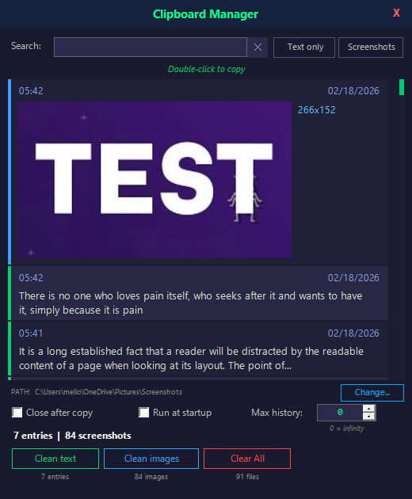

# 📋 Clipboard Manager — Stealth Edition

A lightweight, zero-dependency clipboard history manager for Windows, built entirely in PowerShell.

**Single file. No install. No admin rights. Just run it.**

---

## 🔐 Security Transparency

This script uses techniques that may trigger EDR/antivirus alerts on corporate machines. Here's full transparency on what it does and why:

**Behaviors that may flag:**

| Behavior | Why it's used | Looks like |
|---|---|---|
| `-ExecutionPolicy Bypass` | Required to run unsigned `.ps1` scripts | Policy bypass |
| `CreateNoWindow = $true` | Hides the PowerShell console window | Hidden process |
| `RegisterHotKey` (P/Invoke) | Registers `Ctrl+Shift+H` as global shortcut | Keylogger API |
| Clipboard polling (500ms) | Monitors clipboard for new text/images | Clipboard stealer |
| `ShowWindow(SW_HIDE)` | Removes console from taskbar | Process hiding |
| `WS_EX_TOOLWINDOW` | Hides the UI from Alt+Tab when closed | Stealth window |
| Self-relaunch with `-Hidden` | Ensures zero console flash on startup | Persistence |

**What it does NOT do:**

- ❌ Does **not** capture passwords, credentials, or keystrokes
- ❌ Does **not** send any data over the network — everything stays local
- ❌ Does **not** write to Registry or modify system files
- ❌ Does **not** require admin/elevated privileges
- ❌ Does **not** use obfuscated or encoded code — fully readable `.ps1`
- ❌ Does **not** inject into other processes

> 💡 **For IT teams:** The entire application is a single `.ps1` file (~1350 lines). You can audit every line before approving it.

---

## ✨ Features

### Core
- 🔥 **One-file portable** — just `ClipboardManager.ps1`, nothing else needed
- 🖼️ **Text & image support** — automatically captures copied text and screenshots
- ♾️ **Unlimited history** — set max history to `0` for infinite entries (configurable)
- � **Persistent storage** — history survives restarts, saved as local files

### UI & Design
- 🎨 **Dark themed UI** — custom borderless WinForms window with navy/green color scheme
- 🎯 **Color-coded entries** — green left border for text, blue for images
- 📐 **Custom scrollbar** — slim green scrollbar with drag and click-to-jump support
- 🖱️ **Hover effects** — entries highlight on mouse hover
- 🔀 **Draggable window** — drag the title bar to reposition
- 📊 **Live stats** — entry count, image count, and storage stats shown in footer
- ⏰ **Split timestamp** — time (left) and date (right) shown in each entry's header

### Clipboard Monitoring
- � **Auto-capture** — polls clipboard every 500ms for new content
- 📌 **Smart deduplication** — text checked against entire history, images use pixel-fingerprint comparison
- 🖼️ **Screenshot auto-detect** — finds and integrates your Windows Screenshots folder (OneDrive or local)
- 🧠 **Startup snapshot** — captures current clipboard state on launch to avoid re-adding existing content

### Search & Filter
- � **Debounced search** — 300ms debounce for smooth, lag-free typing across all entries
- ⚡ **Instant type filters** — "Text only" / "Screenshots" toggle buttons (no list rebuild)
- ❌ **Quick search clear** — X button to clear search and refocus

### Copy & Paste
- 📋 **Double-click to copy** — copies text or image back to clipboard
- 🔇 **No-refresh copy** — copying from the list doesn't trigger a list rebuild or create duplicates
- 🚪 **Close after copy** — optionally auto-hide the window after copying (default: on)

### Entry Management
- � **Expand/collapse** — click long text entries to see full content, click again to collapse
- 🖱️ **Right-click context menu** — per-entry menu with:
  - **Open Full Size** — open image in default viewer
  - **Open File Location** — reveal image file in Explorer
  - **Delete** — remove entry (and image file) without full list rebuild
- 🗑️ **Bulk cleanup** — separate "Clean text", "Clean images" buttons with confirmation dialogs
- 🧹 **Clear All** — wipe entire history with one click

### Stealth & Performance  
- 🔒 **Stealth mode** — runs as tray icon only, invisible in taskbar and Alt+Tab
- 👻 **Self-relaunch** — auto-restarts as hidden process (`CreateNoWindow`) on first run
- � **Tray icon** — clipboard icon from `shell32.dll`, double-click to toggle UI
- ⌨️ **Global hotkey** — `Ctrl+Shift+H` works from any app (registered via Win32 API)
- 🚀 **Run at startup** — creates a hidden shortcut in the Windows Startup folder
- ⚡ **Thumbnail caching** — images loaded from disk once, thumbnails cached in memory
- ⚡ **Display list caching** — list only rebuilds when new data arrives
- 🪟 **Tool window** — `WS_EX_TOOLWINDOW` flag hides window from Alt+Tab

### Settings & Configuration
- 📁 **Custom storage path** — "Change..." button to relocate history and images to any folder
- ☑️ **Close after copy** — toggle to auto-hide window after copying
- ☑️ **Run at startup** — toggle to add/remove from Windows Startup
- 🔢 **Max history** — configurable limit (0 = unlimited), auto-cleans oldest entries
- 💾 **Auto-save** — settings saved to `clipboard_settings.ini` automatically

## 📸 Preview



## 🚀 Quick Start

### Run directly
```powershell
powershell -ExecutionPolicy Bypass -File ClipboardManager.ps1
```

### Double-click
1. Right-click `ClipboardManager.ps1` → **Run with PowerShell**
2. The app starts silently — no visible window, no taskbar entry
3. Press `Ctrl+Shift+H` to open

### Auto-start with Windows
1. Open the app with `Ctrl+Shift+H`
2. Check **"Run at startup"** at the bottom
3. A hidden shortcut is created in `shell:startup` — launches silently on every boot

## ⌨️ Keyboard Shortcuts

| Shortcut | Action |
|---|---|
| `Ctrl+Shift+H` | Toggle clipboard manager window (global) |
| `Escape` | Close / hide window |
| `Double-click` | Copy entry to clipboard |
| `Single-click` | Expand / collapse long text entries |
| `Right-click` | Context menu (open, delete) |
| `Ctrl+A` | Select all text in search bar |
| `Ctrl+Backspace` | Delete word in search bar |

## 🔧 Requirements

- **Windows 10 / 11**
- **PowerShell 5.1+** (pre-installed on all Windows 10/11)
- No admin rights needed
- No external dependencies  
- No .NET framework install needed (uses built-in WinForms)

## 📂 Files Created at Runtime

The script creates these files in its directory (or a custom path you choose):

| File | Purpose |
|---|---|
| `clipboard_settings.ini` | User preferences (storage path, max history, close-on-copy) |
| `clipboard_data.txt` | Text clipboard history (one entry per line, custom format) |
| `clipboard_images/` | Captured screenshots saved as `.png` files |

These files are portable — copy them along with the script to migrate your history.

## 🏗️ Architecture

Everything is contained in a single `ClipboardManager.ps1` file (~1350 lines):

```
┌─────────────────────────────────────────┐
│  Self-Relaunch (CreateNoWindow)         │  Lines 10-20
├─────────────────────────────────────────┤
│  P/Invoke Declarations (C#)            │  Lines 25-95
│  RegisterHotKey, ShowWindow, SendMsg   │
│  ExtractIconEx, WS_EX_TOOLWINDOW      │
├─────────────────────────────────────────┤
│  Settings & History Persistence        │  Lines 100-275
│  INI format settings, text file history │
├─────────────────────────────────────────┤
│  Helper Functions                      │  Lines 280-665
│  Copy, Filter, Refresh, Toggle, etc.   │
├─────────────────────────────────────────┤
│  GUI Builder (WinForms)                │  Lines 670-1275
│  Custom dark theme, scrollbar, buttons │
├─────────────────────────────────────────┤
│  Clipboard Monitor & Tray Icon         │  Lines 1280-1354
│  500ms polling, fingerprint dedup      │
└─────────────────────────────────────────┘
```

**Key technical details:**
- **Global hotkey** — registered via `RegisterHotKey` Win32 API, intercepted through custom `HotkeyForm.WndProc`
- **Stealth** — `WS_EX_TOOLWINDOW` hides from Alt+Tab, `ShowInTaskbar=false` hides from taskbar
- **Image dedup** — 5-pixel fingerprint (corners + center) prevents re-capturing identical screenshots
- **Text dedup** — full history scan prevents any duplicate text entries
- **Copy isolation** — `$global:SkipClipCheck` flag + `LastClipText`/`LastImageFingerprint` prevent the monitor from re-detecting content copied via double-click

## 📝 License

MIT License — see [LICENSE](LICENSE) for details.
